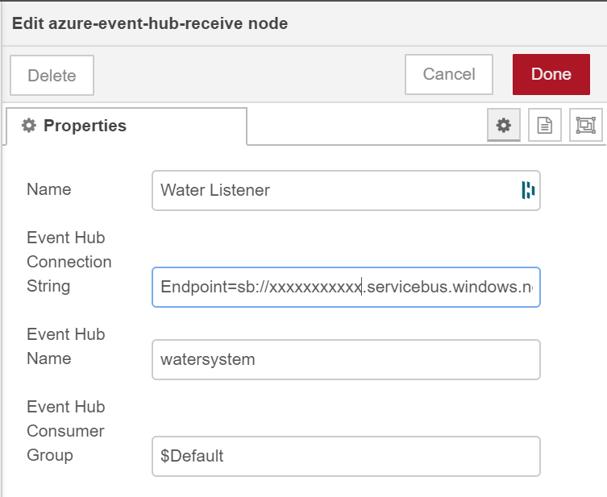

# node-red-contrib-azure-event-hub-receive

**node-red-contrib-azure-event-hub-receive** is a <a href="http://nodered.org" target="_new">Node-RED</a> node that allows you to receive messages from an <a href="https://azure.microsoft.com/en-us/services/event-hubs/">Azure Event Hub</a>.

**This node has been updated to use the latest Azure Java Script SDK**


## Installation

```
npm install -g node-red-contrib-azure-eventhub-receive
```

# Usage

*We assume you have an Event Hub up and running in your Azure subscription. If you don't have an Event Hub yet, check the article <a href="https://docs.microsoft.com/en-us/azure/event-hubs/event-hubs-create">Create an event hub</a> to learn how to create an Event Hub.*

Drop the **node-red-contrib-azure-event-hub-receive** node on a Flow. Double click on the node to open the settings and configure:

- **Event Hub Connection String**: the connection string of the event hub, it can be retrieved from the Azure Portal. It should look like *Endpoint=sb://XXX.servicebus.windows.net/;SharedAccessKeyName=XXX;SharedAccessKey=XXX* It should not contain the EntityPath.
- **Event Hub Name**: the name the event hub, it can be retrieved from the Azure Portal.
- **Event Hub Consumer Group**: the name of the Consumer Group you would like to use. If you didn't create any custom Consumer Groups in your Event Hub, you can use the default name which is *$default*



Connect the ouput of the node to another node, for example the built-in **debug** node. 


**Deploy** the flow, if the connection to the Event Hub is succesful, you'll see a green icon beneath the it's shape with the **connected** label.


When messages are sent to your Event Hub, you'll see the message bodies in the **debug** section of Node-RED (top right).


